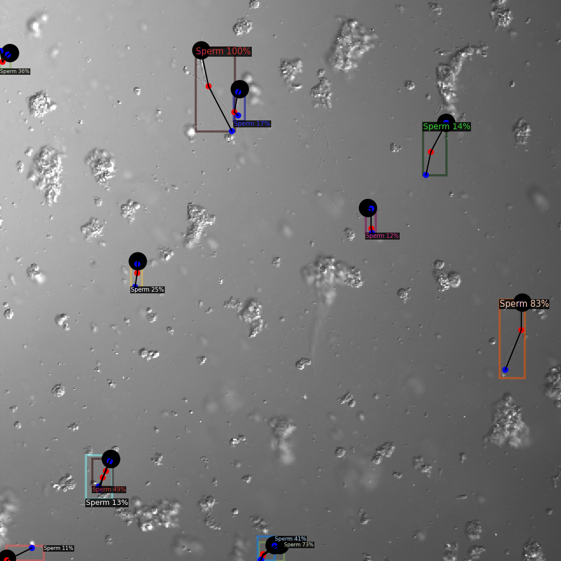

# Keypoint detecton based onthis Based on Detectron2

<div align="center">
  
</div>
<br>

## Installatoin
 * First, install pytorch, then detectron2 first. Then migrate 'keypoint.py' and configs and data(20230104keypoints/2023109keyponts_test) from this repo to the installed detectron2.

* Install detectron2 from this repository (not recomended)

## Usage
All you have to read is keypoint.py which is used training and inference.

### Example : for prediction
```shell
  python keypoint.py --mode detect
```

### Example : for training
```shell
  python keypoint.py --mode train
```

### other options
```python
 parser = argparse.ArgumentParser()
    parser.add_argument('--mode', type=str, default="detect", help='train,resume, detect')
    parser.add_argument('--basedir', type=str, default='/home/ssm-user/detectron2/20230104keypoints', help='base dir')
    parser.add_argument('--dataset', type=str, default='sp12', help='dataset name')
    parser.add_argument('--interactive', type=bool, default=True, help='interactive mode')
    parser.add_argument('--weight', type=str, default='model_final.pth', help='model weight')
    parser.add_argument('--output', type=str, default='output', help='output dir')
    parser.add_argument('--source', type=str, default="20230109keypoints_test/images", help='input source dir (test imaeges dir)')
    parser.add_argument('--sample', type=int, default=0, help='sample number')
    parser.add_argument('--config', type=str, default='COCO-Keypoints/keypoint_rcnn_R_101_FPN_3x.yaml', help='config file')
    parser.add_argument('--label', type=str, default="annotations/person_keypoints_default.json", help='label name relative to base dir')
    parser.add_argument('--image', type=str, default="annotations/images", help='training images dir')

```


